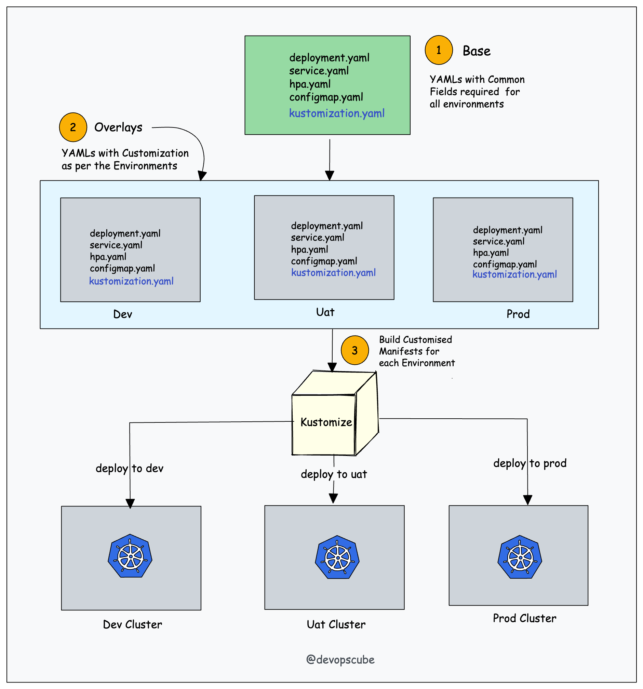

# Kubernetes with Kustomize

<div class="pt-12">
  <span @click="$slidev.nav.next" class="px-2 py-1 rounded cursor-pointer" hover="bg-white bg-opacity-10">
    Press Space for next page <carbon:arrow-right class="inline"/>
  </span>
</div>

<div class="abs-br m-6 flex gap-2">
  <a href="https://ecomm.one-line.com/one-ecom" target="_blank" alt="GitHub"
    class="text-xl slidev-icon-btn opacity-50 !border-none !hover:text-white">
    
  </a>
</div>

---

# What is Kustomize?

Kustomize is an open-source configuration management tool for Kubernetes.
<br>

- <kbd>kustomize</kbd> lets you customize raw, template-free YAML files for multiple purposes, leaving the original YAML untouched and usable as is.

- <kbd>kustomize</kbd> targets kubernetes, it understands and can patch kubernetes style API objects. It's like <kbd>make</kbd>, in that what it
  does is declared in a file, and it's like <kbd>sed</kbd>, in that it emits edited text.

Read more about at <a class="inline-block w-30 ml-2 border-none relative top-1" target="_blank" href="https://kustomize.io/"></a>
<br>
<br>

---

# Overalls

Understanding Kustomize key concepts

- <kbd>kustomization.yaml</kbd> files

- Transformers

- Patches

- Base and Overlays

---

# Apply the deployment to a cluster

Apply a specific deployment object

```yml
kubectl apply -f deployment.yaml
```

```yml
# deployment.yml
apiVersion: apps/v1
kind: Deployment
metadata:
  name: myapp-deployment
spec:
  replicas: 3
  selector:
    matchLabels:
      app: myapp
  template:
    metadata:
      labels:
        app: myapp
    spec:
      containers:
        - name: myapp-container
          image: gcr.io/[PROJECT_ID]/[IMAGE_NAME]:[TAG]
          # asia.gcr.io/one-global-ecommerce-dev/development/ne-support-api:7a2c1e6583131ed1228e08682b5b99cfdc6108fb
```

---

# Kustomize Transformer

Separate yml & modify an image that a specific deployment is going to use (Image Transformer)

```yml
kubectl apply -k .
#or
kustomize build | kubectl apply -f -

```

<div style="display: grid; grid-template-columns: 65% 35%; gap: 16px;">
<div>

```yml
# kustomization.yml
# kustomize edit set image asia.gcr.io/one-global-ecommerce-dev/development/ne-support-api:7a2c1e6583131ed1228e08682b5b99cfdc6108fb
apiVersion: kustomize.config.k8s.io/v1beta1
kind: Kustomization
resources:
  - ./deployment.yml
  - ./service.yml
images:
  - name: asia.gcr.io/one-global-ecommerce-dev/development/ne-support-api
    newTag: 7a2c1e6583131ed1228e08682b5b99cfdc6108fb
```

</div>
```yml
# service.yml
apiVersion: apps/v1
kind: Deployment
metadata:
  name: myapp-deployment
spec:
  replicas: 3
```
<div>
</div>
</div>
File structure
```yml
~/someApp
├── deployment.yaml
├── kustomization.yaml
└── service.yaml
```

---

# Kustomize Patches

Customize or override specific fields without modifying the original resource manifests.

<div style="display: grid; grid-template-columns: 50% 50%; gap: 16px;">
<div>
```yml
# kustomization.yml
apiVersion: kustomize.config.k8s.io/v1beta1
kind: Kustomization
resources:
  - deployment.yaml
patches:
  - path: patches.yaml
    target:
      kind: Deployment
      name: myapp-deployment
      namespace: default
```
</div>
<div>

```yml
# patches.yml
apiVersion: apps/v1
kind: Deployment
metadata:
  name: myapp-deployment
spec:
  replicas: 5
```

</div>
</div>

File structure

```yml
~/someApp
├── deployment.yaml
├── kustomization.yaml
└── patches.yaml
```

---

# Make a base Kustomizion

Make a kustomization as base

<div>

</div>

---

# Make Kustomizion overlays

Create variants using overlays

<div style="display: grid; grid-template-columns: 70% 30%; gap: 16px;">
<div>

</div>
<div>
```yml
~/someApp
├── base
│   ├── deployment.yaml
│   ├── kustomization.yaml
│   └── service.yaml
└── overlays
    ├── development
    │   ├── cpu_count.yaml
    │   ├── kustomization.yaml
    │   └── replica_count.yaml
    └── production
        ├── cpu_count.yaml
        ├── kustomization.yaml
        └── replica_count.yaml
```
</div>
</div>

---

# Solutions

<div >

</div>

---

# Benefits

- <b>Simplified Configuration Management</b>: Kustomize is easy to use and allows you to manage and customize your Kubernetes configurations more easily by enabling you to define your configuration in a structured and modular way.

- <b>Reusability</b>: With Kustomize we can reuse one of the base files across all environments and overlay specifications for each of those environments. This can save you time and effort by allowing you to reuse common configurations rather than having to create them from scratch for each new deployment.

- <b>Version Control</b>: Kustomize allows you to version control your Kubernetes configurations, making it easier to track changes and roll back to previous configurations if necessary.

- <b>Template Free</b>: Kustomize is template free. It expresses the full power of Kubernetes API

---

# Reference

- https://kubectl.docs.kubernetes.io/references/kustomize

- https://devopscube.com/kustomize-tutorial

- https://github.com/kubernetes-sigs/kustomize

---

# QUIZs

> Question 1: What is Kustomize in the context of Kubernetes?

- A. A container runtime
- B. A CI/CD tool
- C. A configuration management tool
- D. A container registry

<br>

> Question 2: What problem does Kustomize solve in Kubernetes deployments?

- A. Resource scaling
- B. Configuration drift
- C. Networking issues
- D. Load balancing

---

# QUIZs

> Question 3: True or False: Kustomize is a built-in feature of Kubernetes.

- A. True
- B. False

<br>

> Question 4: What is a "Kustomization" file in Kustomize, and what is its purpose?

- A. It's used to define Kubernetes clusters.
- B. It's used to customize resource configurations.
- C. It's used to create Docker images.
- D. It's used to define CI/CD pipelines.

---

# QUIZs

> Question 5: How can you set a different image tag for a container using Kustomize?

- A. By editing the base resource YAML directly
- B. By using kubectl apply with the --tag flag
- C. By editing the Kustomization file
- D. By using the kubectl set command

<br>

> Question 6: Name at least two ways to customize Kubernetes resources using Kustomize.

- A. Using Helm charts and JSON files
- B. Using overlays and patches
- C. Using shell scripts and environment variables
- D. Using Terraform and Ansible

---

# QUIZs

> Question 7: What is the difference between a "base" and an "overlay" in Kustomize?

- A. Bases contain resource definitions, overlays apply customizations.
- B. Bases apply customizations, overlays contain resource definitions.
- C. Bases and overlays are the same thing.
- D. Bases and overlays are not used in Kustomize.

<br>

> Question 8: How do you apply Kustomize configurations to your Kubernetes cluster?

- A. Using the kubectl command
- B. Using a web browser
- C. By manually editing YAML files
- D. Using the docker command

---

# QUIZs

> Question 9: When should you use Kustomize instead of Helm for managing Kubernetes configurations?

- A. When you need a package manager
- B. When you want to use Docker Compose
- C. When you need to deploy to multiple clusters
- D. When you need fine-grained customization

<br>

> Question 10: Can you use Kustomize to patch resources in a Kubernetes cluster? If so, how?

- A. No, Kustomize can't be used for patching.
- B. Yes, by defining patches in overlays.
- C. Yes, by using the kubectl patch command.
- D. Yes, by editing the base resource directly.

---

# QUIZs

> Question 11: What is the recommended directory structure for organizing Kustomize configurations?

- A. A single folder for all configurations
- B. A folder for each overlay and a base folder
- C. No specific structure is recommended
- D. A folder for each resource type

<br>

> Question 12: How can you use Kustomize to manage configuration files for different environments (e.g., development, staging, production)?

- A. By creating separate Kubernetes clusters
- B. By using the kubectl apply command
- C. By defining overlays for each environment
- D. By using Docker Compose

---

# Thank you
